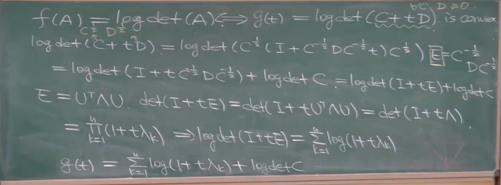

记录一些凸优化基础，线性规划以及内点法。包括多个重要凸函数以及证明过程。
## 几个重要的凸函数
证明：多个凸函数的最大函数仍是凸函数

**已知条件**：
- 给定有限个凸函数集合 {f₁, f₂, ..., fₙ}
- 定义函数 $ g(x) = \max \{ f_1(x), f_2(x), \dots, f_n(x) \} $

**目标**：证明 $ g(x) $ 是凸函数。

---

### 证明步骤

1. **凸函数定义**  
   函数 $ f $ 是凸的，当且仅当对任意 
   $
   x, y\in
   $
   dom
   $
   (f)
   $ 和 $ \lambda \in [0,1] $，满足：
   $
   f(\lambda x + (1-\lambda)y) \leq \lambda f(x) + (1-\lambda)f(y)
   $

2. **对 $ g(x) $ 应用凸函数定义**  
   取任意两点 $ x, y \in 
   $
   dom
   $
   (g) 
   $ 和 $ \lambda \in [0,1] $，需证明：
   $
   g(\lambda x + (1-\lambda)y) \leq \lambda g(x) + (1-\lambda)g(y)
   $

3. **展开左侧表达式**  
   根据 $ g(x) $ 的定义：
   $
   g(\lambda x + (1-\lambda)y) = \max_{i} \left\{ f_i(\lambda x + (1-\lambda)y) \right\}
   $

4. **利用 $ f_i $ 的凸性**  
   每个 $ f_i $ 是凸函数，因此：
   $
   f_i(\lambda x + (1-\lambda)y) \leq \lambda f_i(x) + (1-\lambda)f_i(y)
   $

5. **取最大值不等式**  
   对不等式两边取最大值：
   $
   \max_{i} \left\{ f_i(\lambda x + (1-\lambda)y) \right\} \leq \max_{i} \left\{ \lambda f_i(x) + (1-\lambda)f_i(y) \right\}
   $

6. **分解右侧最大值**  
   由于最大值运算满足线性组合的上界：
   $
   \max_{i} \left\{ \lambda f_i(x) + (1-\lambda)f_i(y) \right\} \leq \lambda \max_{i} f_i(x) + (1-\lambda) \max_{i} f_i(y)
   $
   即：
   $
   \max_{i} \left\{ \lambda f_i(x) + (1-\lambda)f_i(y) \right\} \leq \lambda g(x) + (1-\lambda)g(y)
   $

7. **综合不等式链**  
   结合步骤 4-6 得：
   $
   g(\lambda x + (1-\lambda)y) \leq \lambda g(x) + (1-\lambda)g(y)
   $
   因此，$ g(x) $ 满足凸函数定义。

---

### 总结
- **逐点最大值保持凸性**：即使每个 $ f_i $ 的凸性独立成立，它们的逐点最大值仍能继承凸性。
- **有限性条件**：证明依赖有限个函数的最大值，但结论可推广到可数或不可数情形（需额外条件保证上确界存在）。

**问题**：为什么证明 
$ 
f(A) = \log[\det(A)] 
$ 
是凸函数等价于只需证明 
$ 
g(t) = \log[\det(C + tD)] 
$ 的凸性？
C,D为正定对称阵。

---

**关键思路**：

1. **凸函数的定义**：  
   函数 $ f $ 是凸的，当且仅当对任意 $ A, B \in 
   $
   dom
   $(f) $ 和 $ \lambda \in [0,1] $，有：
   $
   f(\lambda A + (1-\lambda) B) \leq \lambda f(A) + (1-\lambda) f(B).
   $

2. **沿直线方向验证凸性**：  
   对任意两点 $ A $ 和 $ B $，构造方向矩阵 $ D = B - A $，并令 $ C = A $。  
   则两点间的线段可表示为 $ C + tD $（其中 $ t \in [0,1] $）。  
   若对任意 $ C, D $，函数 $ g(t) = \log[\det(C + tD)] $ 在 $ t $ 上是凸的，则原函数 $ f $ 的凸性得证。

3. **单变量函数的凸性**：  
   证明 $ g(t) $ 的凸性比直接处理多变量函数 $ f(A) $ 更简单。  
   例如，可通过计算 $ g''(t) \geq 0 $ 来验证。

4. **定义域限制**：  
   $ C + tD $ 需保持正定（即 $ \det(C + tD) > 0 $），这是 $ f(A) $ 的定义域要求。

---

**结论**：  
将高维凸性问题转化为单变量函数 $ g(t) $ 的凸性证明，本质是利用了凸函数在所有直线方向上的局部性质可推断整体凸性的特性。

关于这个函数的另一个证明：
 