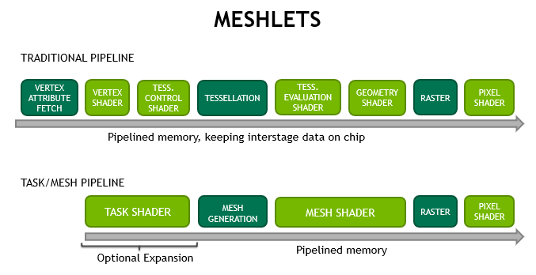

## 目的
组里承接的项目有一个大规模CAD模型需要进行自适应细分研究，由于模型的复杂度和体积，需要使用GPU来进行细分，因此需要研究一下mesh shader的相关技术。

## 相关技术
### GPU Driven Rendering Pipeline

GPU Driven Rendering Pipeline（GDRP）是一种基于GPU的渲染管线，它将渲染任务分解成多个子任务，并将子任务分配给GPU处理，从而提高渲染效率。GDRP的主要特点是将渲染任务分解成多个子任务，并将子任务分配给GPU处理，因此可以提高渲染效率。

### 分割meshlets

- 减少模型所需要传输的数据量，重复的顶点索引变成了代价更小的重复的顶点索引的索引

- 减小剔除的粒度，现在可以基于一个meshlet的粒度来剔除，而不是基于每个模型

### Mesh shader-Meshlet数据结构
- 四个buffer
  1. mesh vertex buffer：顶点数据结构（根据struct体定义）
  2. mesh indiices buffer：顶点索引数据（32-bit）
  3. primitive indices buffer：图元索引（8-bit）（如三角形012 213 345）
  4. meshlet buffer：包含meshlet的相关信息（四个信息：顶点索引偏移、顶点数量、图元偏移和图元数量，前两个用来再vertex indices buffer中定位，后两个用来再primitive indices buffer中定位）

- 32适配Nvida GPU SIMD的wrap size
- 64适配GPU共享内存
- 三角形数 <126 优化索引存储（8-bit）


class MeshletModel {
public:
    // Meshlet is a part of the model's mesh
    // Vertex i of the meshlet, i = 0, 1, ..., vertexCount - 1
    //          vertices[vertexIndices[vertexOffset + i]]
    // Triangle i of the meshlet, i = 0, 1, ..., primitiveCount - 1
    //       vertexOffset + primitiveIndices[primitiveOffset + 3 * i + 0]
    //       vertexOffset + primitiveIndices[primitiveOffset + 3 * i + 1]
    //       vertexOffset + primitiveIndices[primitiveOffset + 3 * i + 2]
    struct alignas(16) Meshlet {
        uint32_t vertexCount;
        uint32_t vertexOffset;
        uint32_t primitiveCount;
        uint32_t primitiveOffset;
    };

    struct alignas(16) Vertex {
        glm::vec3 position;
        float u;
        glm::vec3 normal;
        float v;

        bool operator==(const Vertex& rhs) const noexcept {
            return position == rhs.position && normal == rhs.normal && u == rhs.u && v == rhs.v;
        }
    };

    struct BV {
        alignas(16) glm::vec3 min;
        alignas(16) glm::vec3 max;
    };

public:
    MeshletModel(std::string const& path);

    MeshletModel(const MeshletModel& rhs) = default;

    MeshletModel(MeshletModel&& rhs) noexcept = default;

    ~MeshletModel() = default;

    MeshletModel& operator=(const MeshletModel& rhs) = default;
    
    MeshletModel& operator=(MeshletModel&& rhs) = default;

    std::vector<Vertex> const& getVertices() const noexcept {
        return m_vertices; 
    }

    std::vector<uint32_t> const& getVertexIndices() const noexcept {
        return m_vertexIndices;
    }

    std::vector<uint8_t> const& getPrimitiveIndices() const noexcept {
        return m_primitiveIndices;
    }

    std::vector<Meshlet> const& getMeshlets() const noexcept {
        return m_meshlets;
    }

    BoundingBox getAABB() const noexcept {
        return m_aabb;
    }

    std::vector<BV> const& getMeshletBVs() const noexcept {
        return m_meshletBVs;
    }

protected:
    std::vector<Vertex>   m_vertices;
    std::vector<uint32_t> m_vertexIndices;
    std::vector<uint8_t>  m_primitiveIndices;
    std::vector<Meshlet>  m_meshlets;
    std::vector<BV> m_meshletBVs;

    BoundingBox m_aabb;
};


### 与传统管线的对比

- 流程上：传统管线需要经过顶点着色器，还包括可选的细分着色器，细分评估着色器，几何着色器等在进入光栅化最后进入像素着色器。而GDRP的流程则是以新的两个阶段管道方案代替了经典的顶点、细分、几何管道。这条新管道有任务着色器和网格着色器组成。
    1. 任务着色器：可编程单元，在工作组中工作，允许每个单元发射（或不发射）网格着色器工作组。任务着色器的操作类似于细分的外壳着色器阶段，因为它能够动态生成工作。但是，与网格着色器一样，任务着色器也使用协作线程模式。它的输入和输出是用户定义的，而不必将面片作为输入，将细分决策作为输出。
    2. 网格着色器：可编程单元，在工作组中运行，允许每个工作组生成原语。mesh shader stage 在内部使用上述协作线程模型为光栅化器生成三角形，直通光栅化。

