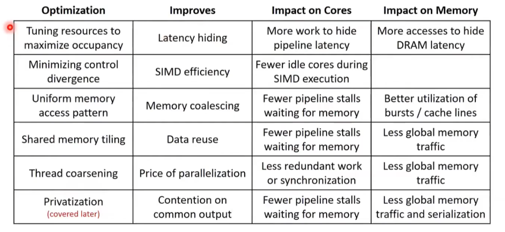

## GPU计算的性能限制
- compute bound：被浮点数运算所限制
- memory bound：被带宽所限制
以V100为例，需要达到15.6op/B的平衡，才会被受限于计算能力，否则，只是受限于存储能力。例如装载两个4B的浮点数据，仅计算一次乘法和一次加法，就是2/8=0.25的OP/B，计算与全局内存访问比为0.25.
- 如何提高？可以使用共享内存，同一个block内的线程共享部分数据，减少对全局内存的访问

## 访存合并 Memory Coalescing

- 同一个线程束（wrap）访问连续显存区域时会做访存合并，提高效率，比如分成32*32的格局时，y=0，x=0到y=0，x=31的线程再同一个warp里。
- 硬件上，跟DRAM的结构有关，从Row Decoder到DRAM Array再到信号放大器，列锁存器->Mux（多路选择器）。第一阶段耗时较多，后面突发传输阶段比较快。
- 多个DRAM ARRAY公用一条数据总线，可以支持，一个在解码，一个已经在mux，可以隐藏延迟。准备数据与读取数据错开，形成一直能有数据读取，而不是读取之后，数据总线在等数据从某个bank（存储体）上准备好了再传输。从列所存到mux为一次突发传输。若在同一行的列选择中，可以直接再多路选择器中读取。
- 如何触发，需要保证大量warps进行调度，保持高占有率，同时还能保证流水线延迟（core上的，有关于计算）。

## 线程细粒度化
- 保证线程任务最小化，从程序中挖掘出更多并行性。
- 资源有限时，串行化，但未来GPU资源变多，不用改变程序，一样可以更多地并行，这叫透明可拓展性。

## 线程粗化
- 让一个线程处理多个并行单元，减少的访存操作或者其他计算步骤。
- 过度粗化，也会使得并行线程变少，资源使用不足。

## GPU优化手段概览

## convolution卷积

- 使用常量内存，存放卷积核，卷积核比较小，且不变。访问常量内存速度快。（64KB）常量构建缓存友好。不用处理脏位，写回这些操作。无需缓存一致性协议。
- 容量小，可全部放入sm的常量缓存